# Design pass verification

Captured on 3 October 2026 with Chrome headless against production builds. Before images use an isolated archive of local `main`; after images use `feat/design-pass`. Desktop viewport: 1440 × 1000. Mobile viewport: 360 × 1000. Images capture the full page.

| Page             | Default Lighthouse accessibility | High contrast Lighthouse accessibility | axe WCAG findings |
| ---------------- | -------------------------------- | -------------------------------------- | ----------------- |
| `/`              | 100                              | 100                                    | 0                 |
| `/match`         | 100                              | 100                                    | 0                 |
| `/accessibility` | 100                              | 100                                    | 0                 |

See [lighthouse.json](lighthouse.json), [after-audit.json](after-audit.json) and [keyboard-audit.json](keyboard-audit.json). The Lighthouse run includes the accessible-name check; no failing audits remain. These automated checks do not replace testing with assistive-technology users.

Verified no horizontal overflow on all three pages at 320, 360 and 1440 px with A++ (23.4 px root). Headings resolve to Source Serif 4 and body to Source Sans 3. Both fonts load with Polish diacritics at A, A+ and A++. Font preferences persist after reload. First Tab reaches the skip link, Enter focuses main, and Escape closes the mobile menu and returns focus to its trigger. Match submission preserves URL state and focuses the results heading.

The screenshots include both themes, A++, and populated match results. `before-audit.json` confirms all four before captures rendered without browser exceptions.

Tools: Playwright with installed Chrome, axe-core, Lighthouse. Audit tools were installed temporarily, outside the committed dependency set. Production and unit checks use Node 22.23.3.

## Desktop

| Page  | Before                                    | After                                   |
| ----- | ----------------------------------------- | --------------------------------------- |
| Home  | 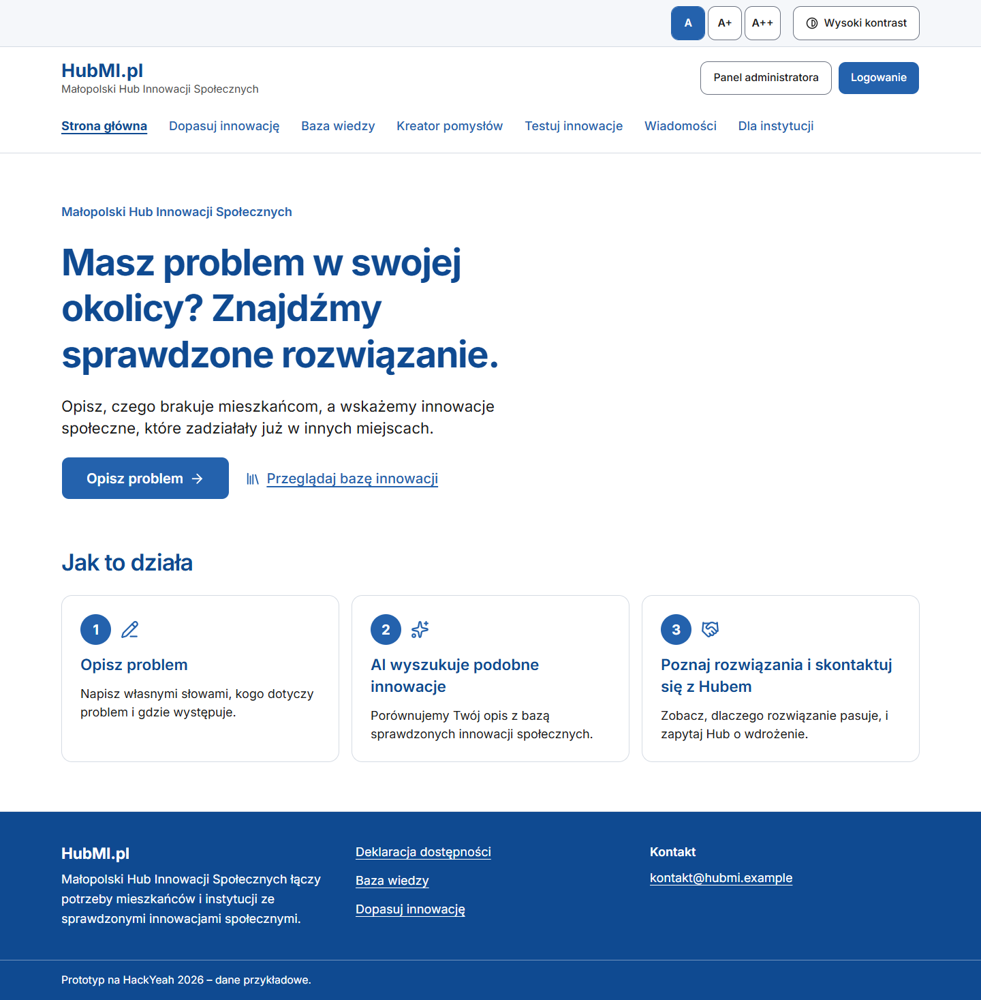   | 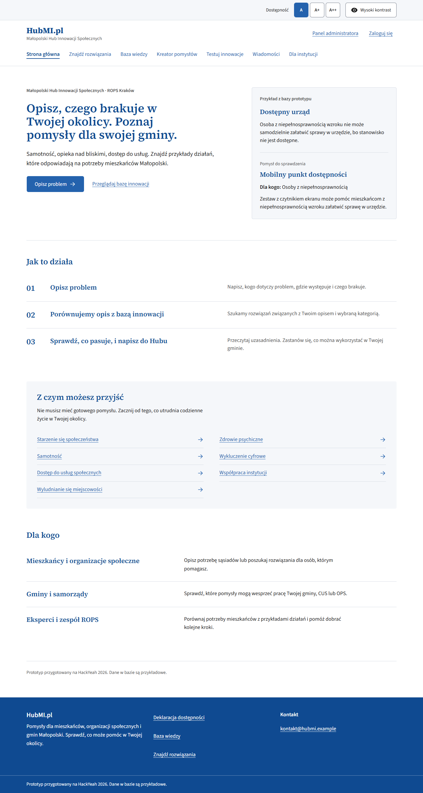   |
| Match | 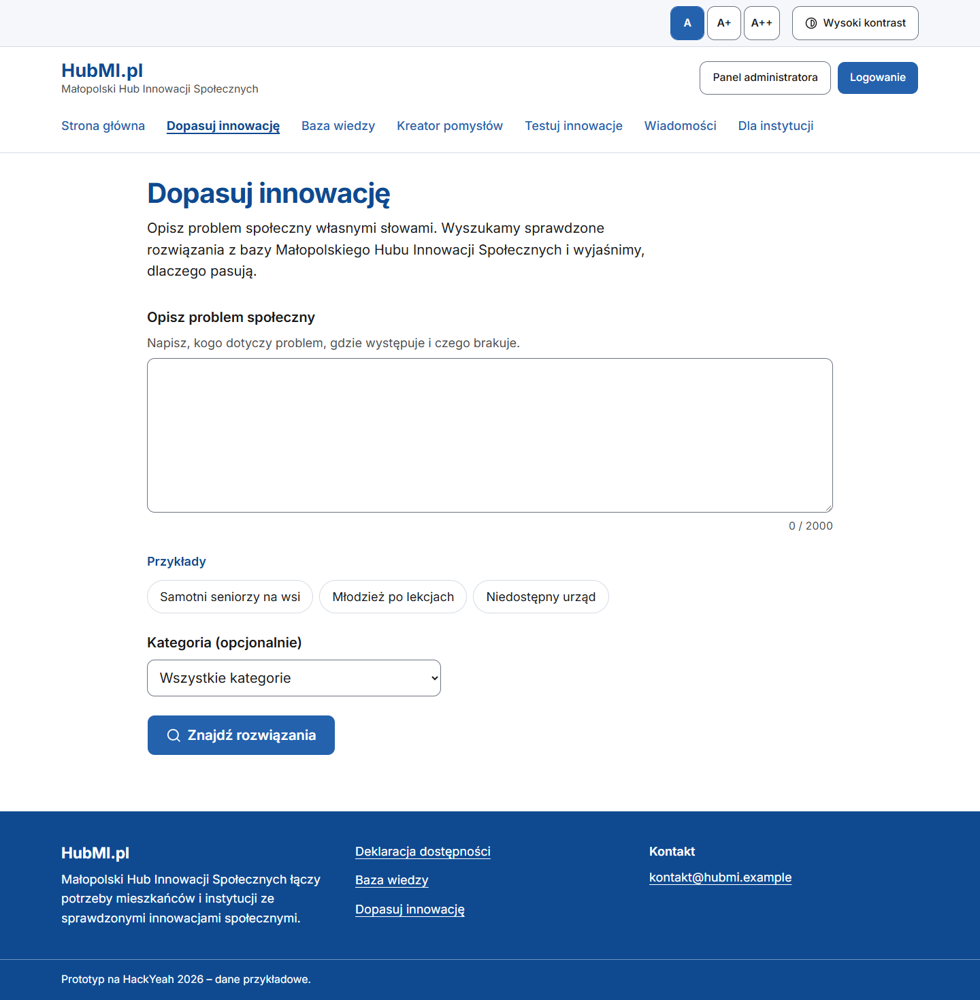 | 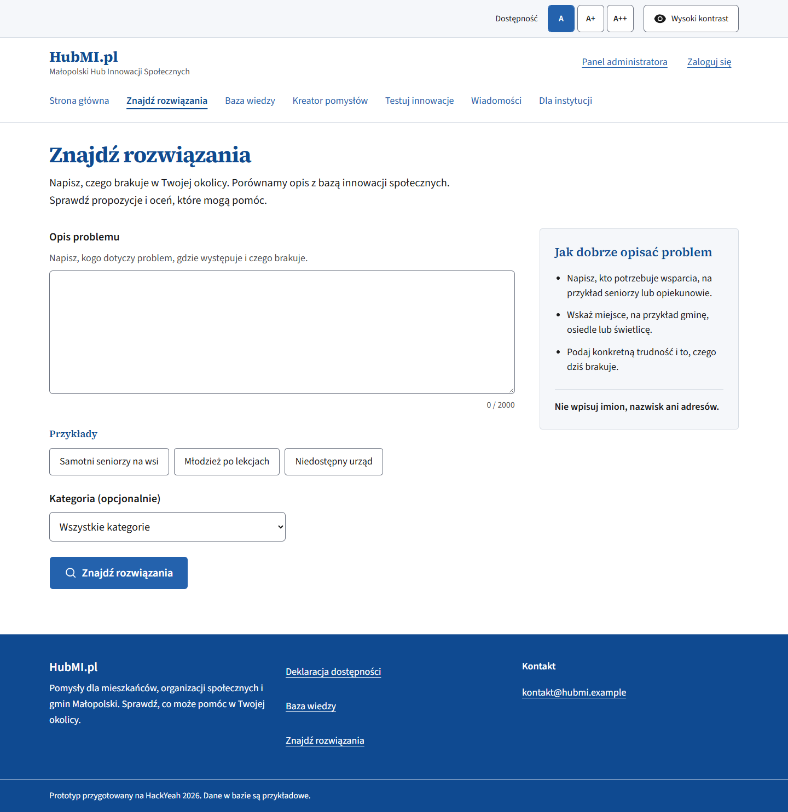 |

## Mobile

| Page  | Before                                   | After                                  |
| ----- | ---------------------------------------- | -------------------------------------- |
| Home  | 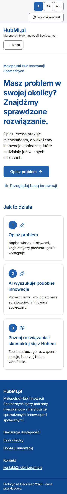   | 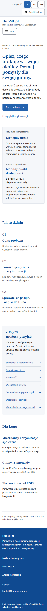   |
| Match | 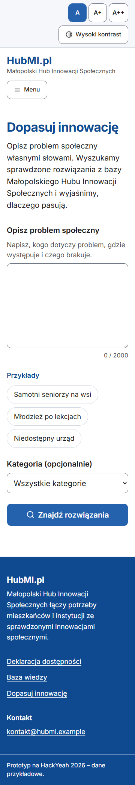 | 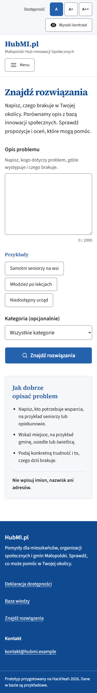 |

## Preference and result checks

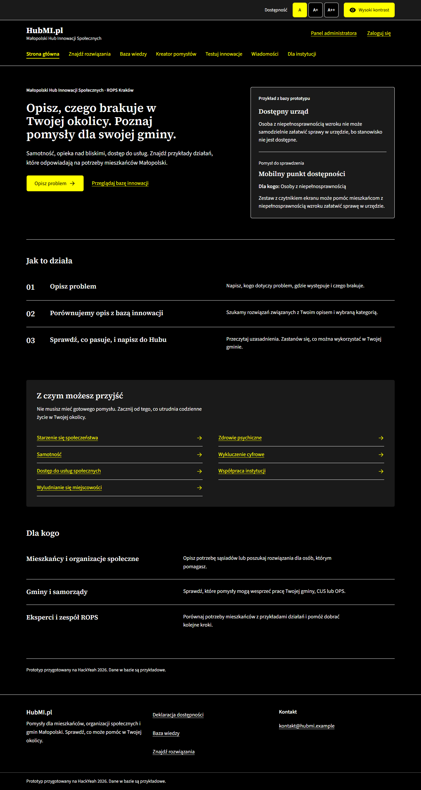

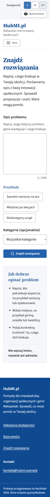

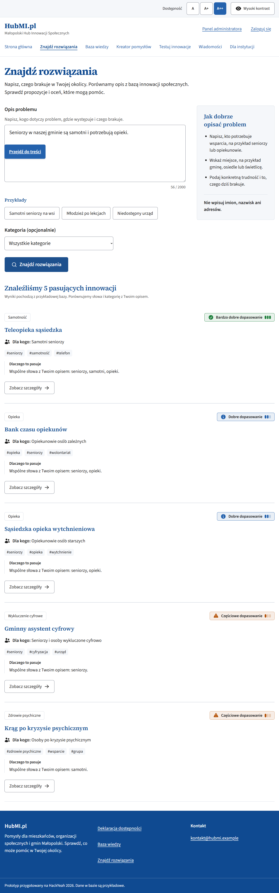
