# Visual pass verification (#40)

Captured on 3 October 2026 with Chrome headless against production builds in demo mode, so that every module, including `/admin` and `/messages`, opens without an account. Before images use `main` at `857eaed`; after images use `chore/visual-pass`. Full-page captures at 1280 px and 360 px.

`before-audit.json` and `after-audit.json` contain the automated measurements for all 17 routes at both widths and in both themes: font families and weights, sizes off the STYLE.md scale, radii above 8 px, content shadows, gradients and blur, running animations, all-caps text and letter-spacing, centred body text, paragraphs longer than about 80 characters, highlight count, horizontal overflow, and serious or critical axe findings.

## Before and after

| Screen               | Before                                    | After                                    |
| -------------------- | ----------------------------------------- | ---------------------------------------- |
| Home, 1280           | 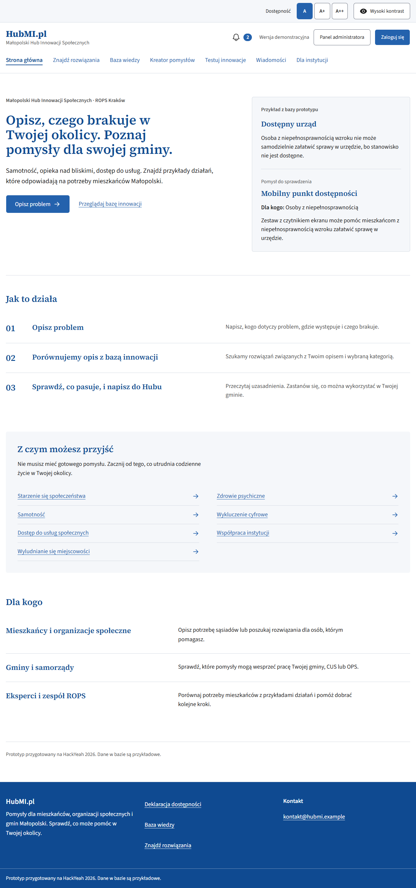         | 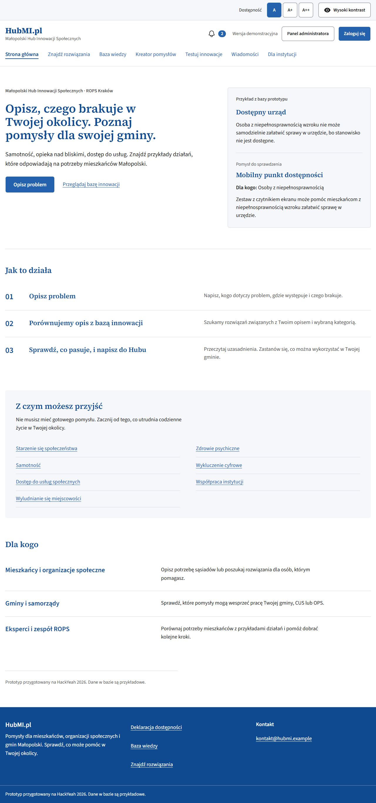         |
| Ideas, 1280          | 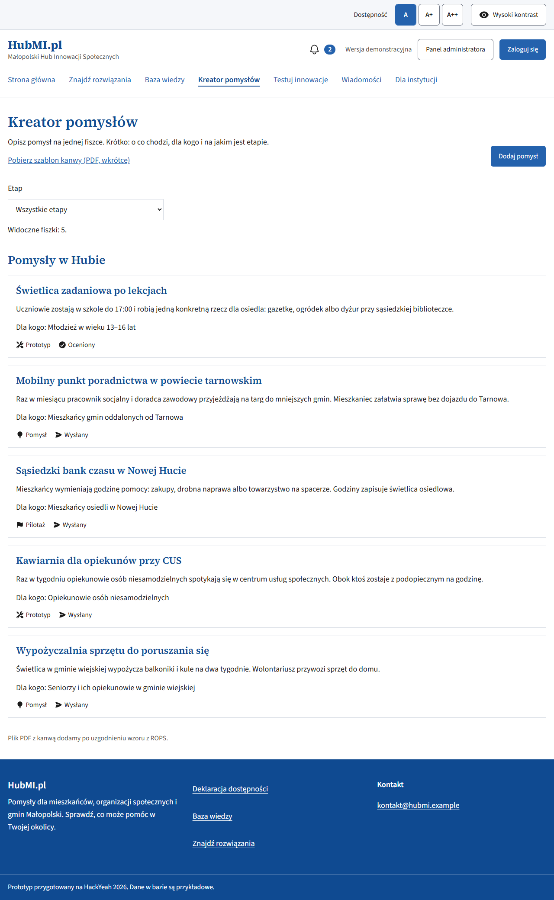        | 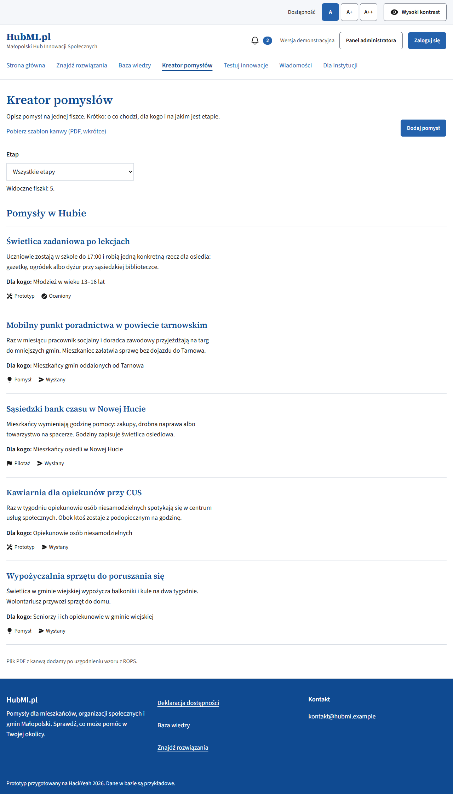        |
| Ideas, 360           | 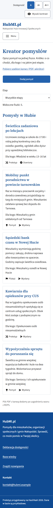         | 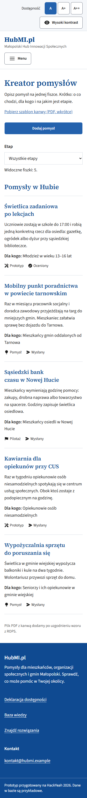         |
| Messages, 360        | 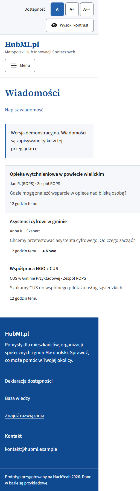      | 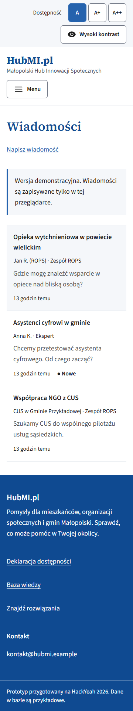      |
| Knowledge, 1280      |     | 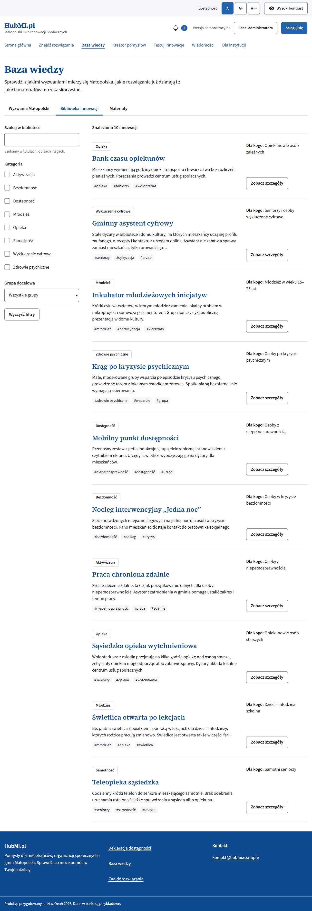    |
| Test detail, 1280    | 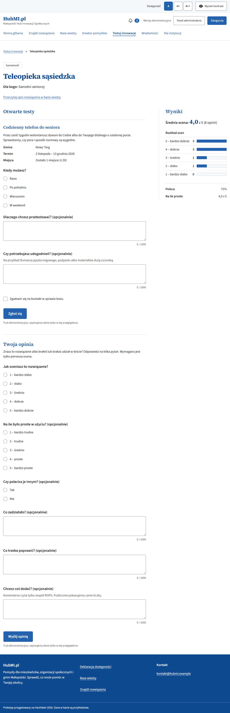  | 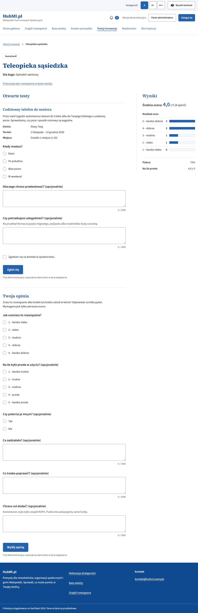  |
| Admin overview, 1280 | 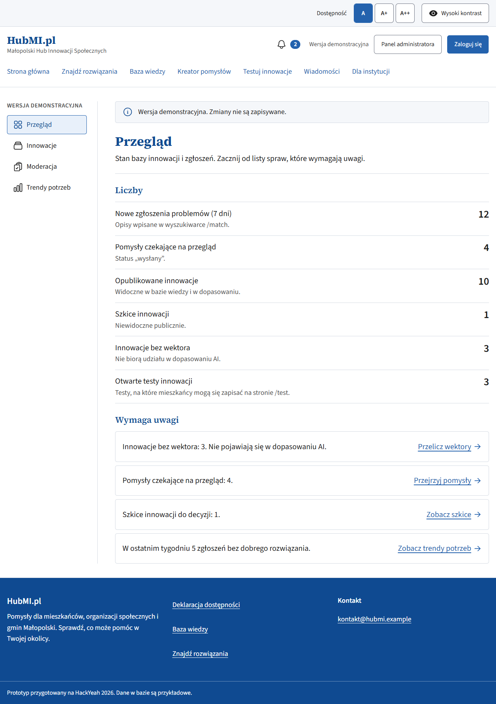        | 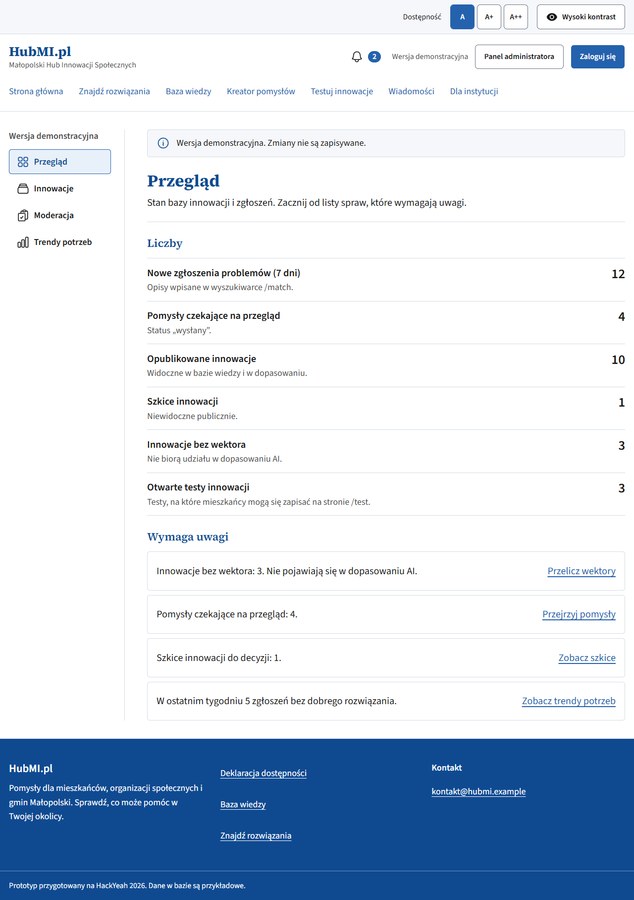        |
| Accessibility, 360   | 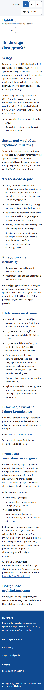 | 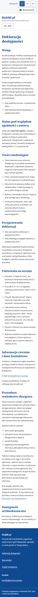 |

## After: high contrast, A++ and the admin table

| Screen                                | Image                                              |
| ------------------------------------- | -------------------------------------------------- |
| Home, high contrast, 1280             | 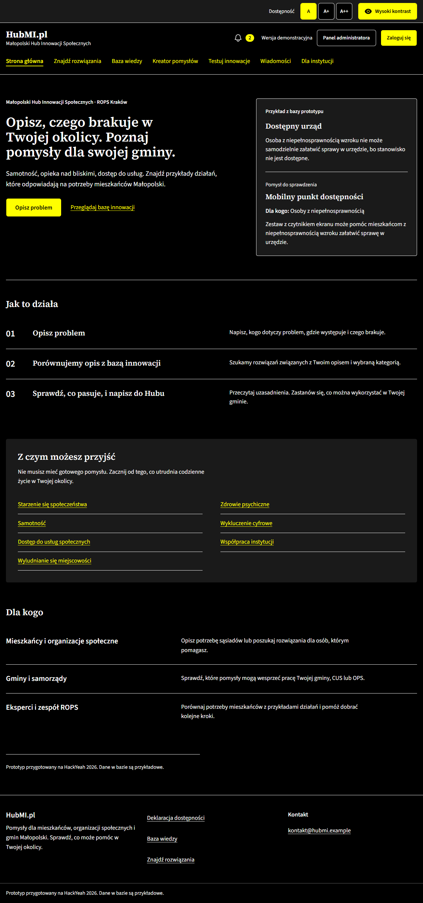             |
| Institutions, high contrast, 1280     | 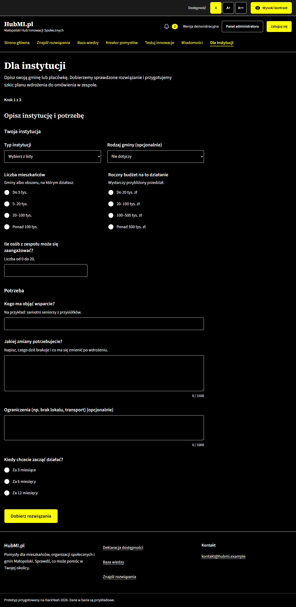     |
| Admin innovations, high contrast, 360 | 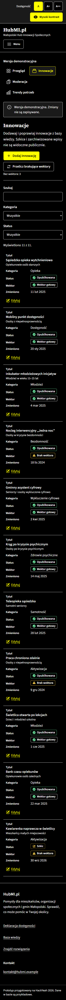 |
| Admin innovations, 1280               | 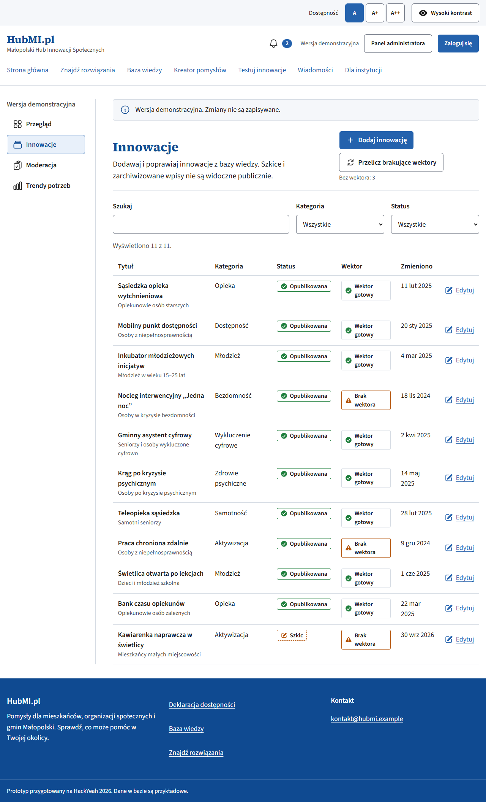      |
| Home at A++ (23.4 px root), 1280      | 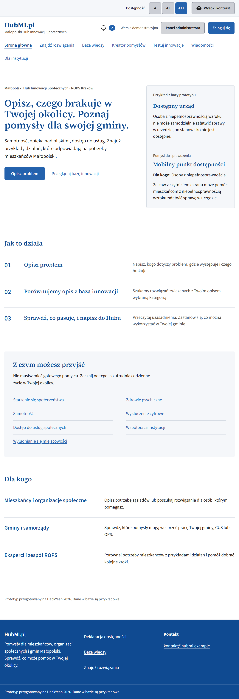               |

Tools: puppeteer-core with installed Chrome, axe-core and Lighthouse, installed temporarily outside the committed dependencies.
